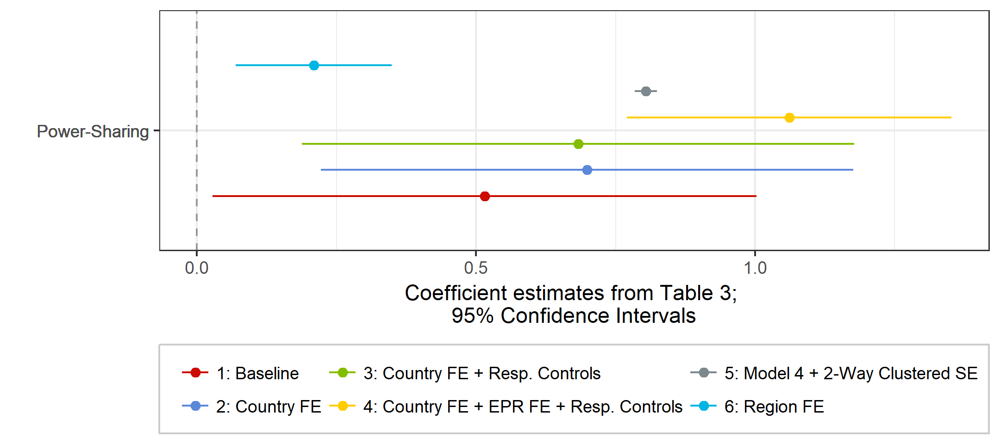

```{r setup, include=FALSE}
knitr::opts_chunk$set(echo = FALSE, 
                      # cache = T,
                      dev = "CairoPNG",
                      # bitmapType = 'cairo',
                      warning = FALSE, message = FALSE)
htmltools::tagList(rmarkdown::html_dependency_font_awesome())

```


# Coefficient plots

Coefficient plots ("dot-and-whisker" plots) are a useful way to visualize regression models:

- No asterisks/superscripts necessary to display statistical significance
- Uncertainty better visualized through confidence intervals
- Effect size becomes more clear

Example from my own work:
<div align = "center">

</div>
For more information, see [Kastellec and Leoni 2007](http://www.princeton.edu/~jkastell/Tables2Graphs/graphs.pdf)


---

# The dotwhisker package: basic usage

In R, we use the `dotwhisker` package by Frederik Solt and Yue Hu to generate coefficient plots. The `dotwhisker` package builds on the `ggplot2` architecture, which makes it easy to use. 

Basic Usage:

```{r, echo = T, warning = F, eval = F, units = "in", dpi = 300, fig.width=6, fig.height = 3, fig.align = "center"}
library(tidyverse)
library(dotwhisker)
library(gapminder)

# regress lifeExp on gdpPercap + population

m1 <- lm(lifeExp ~ log(gdpPercap) + log(pop), data = gapminder)

dwplot(m1)


```

---

# The dotwhisker package: basic usage

```{r, echo = F, warning = F, eval = T, units = "in", dpi = 300, fig.width=6, fig.height = 3, fig.align = "center"}
library(tidyverse)
library(dotwhisker)
library(gapminder)

# regress lifeExp on gdpPercap + population

m1 <- lm(lifeExp ~ log(gdpPercap) + log(pop), data = gapminder)

dwplot(m1) # default 95% confidence level, change with alpha = 0.01 option to 99%

```


---

# Plot multiple models

```{r, echo = T, warning = F, eval = T, units = "in", dpi = 300, fig.width=6, fig.height = 2.5, fig.align = "center"}

m1 <- lm(lifeExp ~ log(gdpPercap) + log(pop), data = gapminder)

# add predictors: continent fixed effects
m2 <- lm(lifeExp ~ log(gdpPercap) + log(pop) + continent, data = gapminder)

dwplot(list(m1, m2))  

```


---

# tidy models

Instead of passing an `lm` model object, we can transform our model object(s) into tidy data frames, using the `broom` package. This has several advantages, including omitting coefficients from the output, that might not be needed in the final plot. 

```{r, echo = T, warning = F, eval = T, units = "in", dpi = 300, fig.width=6, fig.height = 2.5, fig.align = "center"}
library(broom)

# Estimate models
m1 <- lm(lifeExp ~ log(gdpPercap) + log(pop), data = gapminder)
m2 <- lm(lifeExp ~ log(gdpPercap) + log(pop) + continent, data = gapminder)

# transform model objects into data frames
m1_tidy <- tidy(m1) # 'tidy()' function is from the broom package
m2_tidy <- tidy(m2)

m1_tidy

```

---

# tidy models II


```{r, echo = T, warning = F, eval = T, units = "in", dpi = 300, fig.width=6, fig.height = 2.5, fig.align = "center"}
library(broom)

# Estimate models
m1 <- lm(lifeExp ~ log(gdpPercap) + log(pop), data = gapminder)
m2 <- lm(lifeExp ~ log(gdpPercap) + log(pop) + continent, data = gapminder)

# transform model objects into data frames
m1_tidy <- tidy(m1) 

# add model name to tidy data frame
m1_tidy <- m1_tidy %>% 
  mutate(model = "Baseline")

# repeat for model 2
m2_tidy <- tidy(m2)
m2_tidy <- m2_tidy %>% 
  mutate(model = "Continent FE")

# "glue" model data frames together
all_models <- bind_rows(m1_tidy, m2_tidy)

```


---

# tidy models II
```{r, echo = F, warning = F, eval = T, units = "in", dpi = 300, fig.width=6, fig.height = 2.5, fig.align = "center"}
all_models %>% select(-statistic)
```


---

# tidy models III
```{r, echo = T, warning = F, eval = T, units = "in", dpi = 300, fig.width=6, fig.height = 2.5, fig.align = "center"}

# keep only the coefficients with "log" in the name, i.e. the GDP and population 
all_models <- all_models %>% 
  filter(grepl("log", term))

all_models

```


---

# tidy models IV

Plot the resulting tidy data frame with `dwplot()`
```{r, echo = T, warning = F, eval = T, units = "in", dpi = 300, fig.width=6, fig.height = 2.5, fig.align = "center"}

dwplot(all_models)

```

---

# Manipulating dwplot output

```{r, echo = T, warning = F, eval = T, units = "in", dpi = 300, fig.width=6, fig.height = 2.5, fig.align = "center"}

# relabel predictors, because we want nicer variable names
all_models <- all_models %>% 
  relabel_predictors(c(`log(gdpPercap)` = "GDP/pc (log)", 
                       `log(pop)` = "Population (log)"))

# adjust colors + shapes
coefplot_allmodels <- dwplot(all_models, 
                             # here are our regular aesthetics
                             dot_args = list(aes(colour = model, 
                                             shape = model)), 
                             size = 3) + 
  theme_bw() + 
  labs(title = "Predicting Life Expectancy", 
       x = "Coefficient Estimate with 95% CIs", 
       y = "") +
  theme(plot.title = element_text(face="bold"),
        legend.position = "bottom",
        legend.background = element_rect(colour="grey80"),
        legend.title.align = .5) +
  scale_shape_discrete(name  ="Models", breaks = c(0, 1)) + # breaks assign shapes
  scale_colour_grey(start = .3, end = .7, name = "Models") # start/end for light/dark greys
```

---

# Manipulating dwplot output 

```{r, echo = F, warning = F, eval = T, units = "in", dpi = 300, fig.width=6, fig.height = 3, fig.align = "center"}
 
print(coefplot_allmodels)  
```


---

# Exercise

Add a third model to `all_models` that includes country fixed effects. (Hint: you can add country dummies in `R` by simply adding the name of a categorical variable into the `lm()` call).

The baseline model stays

`lm(lifeExp ~ log(gdpPercap) + log(pop), data = gapminder)`

Plot the comparison of a the baseline model, the continent FE, and the country FE model. 

---

# Solution I


```{r, echo = T, warning = F, eval = T, units = "in", dpi = 300, fig.width=6, fig.height = 3, fig.align = "center"}

# Model Estimation and data preprocessing

m1 <- lm(lifeExp ~ log(gdpPercap) + log(pop), data = gapminder)
m2 <- lm(lifeExp ~ log(gdpPercap) + log(pop) + continent, data = gapminder)
m3 <- lm(lifeExp ~ log(gdpPercap) + log(pop) + country, data = gapminder)

# tidy models
m1_tidy <- tidy(m1) %>% 
  mutate(model = "Baseline")
m2_tidy <- tidy(m2) %>% 
  mutate(model = "Continent FE")
m3_tidy <- tidy(m3) %>% 
  mutate(model = "Country FE")

# 'glue' the models together

all_models <- bind_rows(m1_tidy, 
                        m2_tidy, 
                        m3_tidy) %>% 
  filter(grepl("log", term))
 
```

---

# Solution II

```{r, echo = T, warning = F, eval = T, units = "in", dpi = 300, fig.width=6, fig.height = 3, fig.align = "center"}

# relabel predictors
all_models <- all_models %>% 
  relabel_predictors(c(`log(gdpPercap)` = "GDP/pc (log)", 
                       `log(pop)` = "Population (log)"))

# adjust colors + shapes
coefplot_allmodels <- dwplot(all_models, 
                             dot_args = list(aes(colour = model, 
                                             shape = model)), 
                             size = 3) + 
  theme_bw() + 
  labs(title = "Predicting Life Expectancy", 
       x = "Coefficient Estimate with 95% CIs", y = "") +
  theme(plot.title = element_text(face="bold"),
        legend.position = "bottom",
        legend.title.align = .5) + 
  scale_shape_discrete(name  ="Models", breaks = c(0, 1)) + 
  scale_colour_grey(start = .3, end = .7, name = "Models") 


```


---

# Solution III

```{r, echo = T, warning = F, eval = T, units = "in", dpi = 300, fig.width=6, fig.height = 3, fig.align = "center"}
   
print(coefplot_allmodels)   
```

