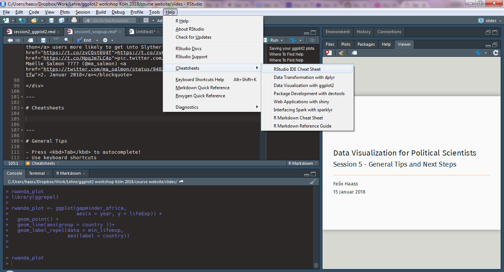

```{r setup, include=FALSE}
knitr::opts_chunk$set(echo = FALSE, 
                      cache = T,
                      units = "in", dpi = 300, fig.height = 4, fig.align = "center",
                      dev = "CairoPNG",
                      # bitmapType = 'cairo',
                      warning = FALSE, message = FALSE)
htmltools::tagList(rmarkdown::html_dependency_font_awesome())

```
# Saving your ggplot2 plots

We use the `ggsave()` function to export plots in any format we like. Simply include the `ggsave()` call after your ggplot2 building blocks, using variations of the following options

```{r, echo = T, warning = F, eval = F, units = "in", dpi = 200, fig.height = 4, fig.align = "center"}

ggsave(filename = "./figures/rwanda_plot.png",  # remember "figures" folder?
                                                # ".png" suffix determines file type
       plot = rwanda_plot, # which plot to save?
       width = 8, height = 4.5, # values between 5 and 10 inches are reasonable
       units = "in", 
       dpi = 300, # 300dpi = printing quality
       scale = 0.8) # enlarge (< 1) / shrink (> 1) text


```

---

# Where To Find Help

.font150[[Data Visualization - A practical introduction](http://socviz.co/)]

by Kieran Healy (forthcoming Princeton University Press)

<div align = "center">

</div>


---

# Where To Find Help

.font150[[StackOverflow](https://stackoverflow.com/questions/tagged/ggplot2)]

Tip: include the term "stack" and "ggplot" in your google query terms

<div align = "center">

</div>


---

# Where To Find Help

.font150[[R for Data Science](http://r4ds.had.co.nz/)]

<div align = "center">

</div>


---

# Where To Find Help

[#rstats Twitter hashtag](https://twitter.com/hashtag/rstats)

<div align = "center">
<blockquote class="twitter-tweet" data-lang="de"><p lang="en" dir="ltr">When you&#39;re using a new R package and everything you try results in the red error code of nope <a href="https://twitter.com/hashtag/Rstats?src=hash&amp;ref_src=twsrc%5Etfw">#Rstats</a> <a href="https://t.co/tcBMypctwi">pic.twitter.com/tcBMypctwi</a></p>&mdash; Daniel Swindlehurst (@SwindleApe) <a href="https://twitter.com/SwindleApe/status/938025492103524352?ref_src=twsrc%5Etfw">5. Dezember 2017</a></blockquote>
<script async src="https://platform.twitter.com/widgets.js" charset="utf-8"></script>


</div>


---

# Cheatsheets

<div align = "center">

</div>


---

# General Tips

- Press <kbd>Tab</kbd> to autocomplete!
- Use keyboard shortcuts
    - <kbd>Strg/Ctrl</kbd> + <kbd>Shift</kbd> + <kbd>M</kbd> for `%>%`
    - <kbd>Alt</kbd> + <kbd>-</kbd> for `<-`
    - <kbd>Shift</kbd> + <kbd>1/2/3</kbd> switches between RStudio panes
- Name things often & understandably (e.g. not `m1` but `baseline_model`)
    - Follow a style guide
- Use comments `#` often and judiciously
    - Comment out several lines of code with <kbd>Strg/Ctrl</kbd> + <kbd>Shift</kbd> + <kbd>c</kbd>
- Look for package vignettes on Google
    


---

class: inverse, center, middle

# Questions?

---

# Labels and Text

`geom_text` is useful for simple text display; `geom_repel` from the `ggrepel` package has more advanced functions. 

```{r, echo = T, eval = T}
library(tidyverse)
library(gapminder)

gapminder_africa <- gapminder %>% 
  filter(continent == "Africa") %>% 
  filter(year > 1990)

rwanda_plot <- ggplot(gapminder_africa, 
                      aes(x = year, y = lifeExp)) +
  geom_point() +
  geom_text(aes(label = country)) # `label` is an aesthetic like `color`
                                  # we map 'country' to label

```

---

# Labels and Text

```{r, echo = F, eval = T}

plot(rwanda_plot)

```

---

# Labels and Text: Subset data first!

It often makes sense to create a separate data frame with the labels you want to you plot. 

```{r, echo = T, eval = T}

min_lifeexp <- gapminder_africa %>% 
  # select only observation with smallest
  # or biggest lifeExp (outliers)
  filter(lifeExp == min(lifeExp) | lifeExp == max(lifeExp)) 

rwanda_plot <- ggplot(gapminder_africa, 
                      aes(x = year, y = lifeExp)) +
  geom_point() +
  geom_text(data = min_lifeexp, 
            aes(label = country))    

```

---

# Labels and Text: Subset data first!

```{r, echo = F, eval = T}

plot(rwanda_plot)

```

---

# Labels and Text: ggrepel


```{r, echo = T, eval = T}
library(ggrepel)

rwanda_plot <- ggplot(gapminder_africa, 
                      aes(x = year, y = lifeExp)) +
  geom_point() +
  geom_label_repel(data = min_lifeexp, 
                   aes(label = country))    

```

---

# Labels and Text: ggrepel

```{r, echo = F, eval = T}

plot(rwanda_plot)

```

---

# Histograms and variable distributions

```{r, echo = T, eval = T, fig.height = 3}

lifexp_histplot <- ggplot(gapminder, 
                          aes(x = lifeExp)) + # note that no 'y' mapping
  geom_histogram() +
  facet_wrap(~ continent)

print(lifexp_histplot)

```


---

# Additional exercises

1. Plot a scatterplot of the relationship between `gdpPercap` and `lifeExp` and adjust the point size to population. 

2. Install the `WDI` package to access World Bank data. Use the help function `help(WDI)` to find out how the package's main function `WDI()` works. Download data for GDP (indicator: `NY.GDP.MKTP.CD`) and corruption (indicator `IQ.CPA.TRAN.XQ`). Try to plot the two variables for all countries in the world. 


